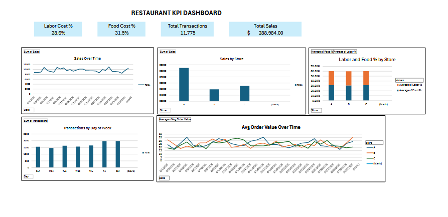

# Restaurant KPI Dashboard

This project simulates restaurant operations over a 30-day period across multiple store locations. The dashboard is built in **Microsoft Excel** using Pivot Tables, charts, and calculated KPIs. It provides a clear visual breakdown of sales, labor and food costs, customer activity, and revenue patterns to support decision-making in a multi-unit restaurant business.

---

## Tableau Dashboard (Live)

Check out my interactive version of this dashboard, built in Tableau:

[View on Tableau Public](https://public.tableau.com/app/profile/joshua.peters1940/viz/Book1_17544206343460/Dashboard1#1)

---

## Key Metrics Tracked
- **Total Sales** across all locations
- **Total Transactions**
- **Average Order Value (AOV)**
- **Average Labor Cost %**
- **Average Food Cost %**
- **Sales Trends Over Time**
- **Sales by Store**
- **Transactions by Day of Week**
- **Labor and Food Cost % by Store**
- **AOV Trends Over Time by Store**

---

## Tools Used
- **Microsoft Excel**
  - Pivot Tables & Charts
  - Percentage-based formatting
  - Conditional styling
- Simulated data generated in `.csv` format

---

## Preview

---

## Insights
- **Labor cost** averaged around **28.6%**, while **food cost** remained near **31.5%**
- **Store A** consistently had the highest total sales, followed by C and B
- **Friday and Saturday** saw the most customer traffic across all stores
- **Average Order Value** remained stable, but showed upward trends at Store A
- **Operational costs were steady**, indicating balanced staffing and purchasing

---

## Files Included
- /images/
- dashboard_screenshot.png ← Preview of the dashboard layout
- Restaurant_KPI_Dashboard.xlsx ← Final Excel dashboard with formulas + visuals

---

## Contact

Created by **Joshua Peters**  
- 🌐 [Portfolio Website](https://e-portfolio-one-gold.vercel.app/)
- 📧 jdpeters33@gmail.com

---

